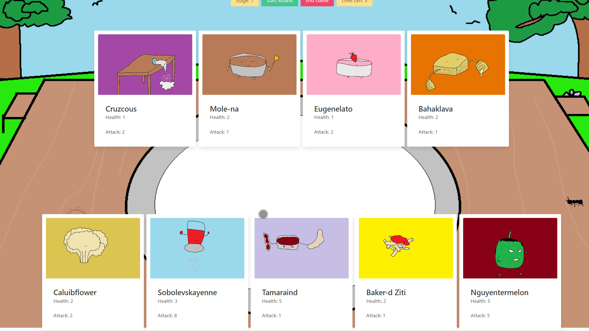

# Gourmet Gauntlet

## Technology Used 

| Technology Used         | Resource URL           | 
| ------------- |:-------------:| 
| JavaScript | [https://developer.mozilla.org/en-US/docs/Web/JavaScript](https://developer.mozilla.org/en-US/docs/Web/JavaScript)|   
| Git | [https://git-scm.com/](https://git-scm.com/) |
| React | [https://react.dev/](https://react.dev/) |
| MongoDB | [https://www.mongodb.com/](https://www.mongodb.com/) |
| Mongoose | [https://mongoosejs.com/docs/](https://mongoosejs.com/docs/) |
| GraphQL | [https://graphql.org/](https://graphql.org/) |
| Bulma CSS | [https://bulma.io/](https://bulma.io/) |
| ChartJS | [https://www.chartjs.org/](https://www.chartjs.org/) |
| AnimeJS | [https://animejs.com/](https://animejs.com/) |

<hr>

## Description 

Gourmet Gauntlet is a auto-battler-card-game that randomly generates cards for the user to select to battle through stages of enemies. 



<hr>

## Table of Contents

* [Code Sample](#code-sample)
* [Usage](#usage)
* [Learning Points](#learning-points)
* [Author Info](#author-info)

<hr>

## Code Sample

### React: dynamic 

The code snippet below is examples of how we used React to render our web pages.

```js
// starting at our App.js, this is how we used react router to render certain components based on the path that the user is on
function App() {
  return (
    // give ApolloProvider our client variable so that we can utilize context throughout the rest of our pages
    <ApolloProvider client={client}>
      <Router>
        <div>
          <Header />
          <Routes>
            <Route path="/" element={<Home />} />
            <Route path="/battle" element={<Battle />} />
            <Route path="/login" element={<Login />} />
            <Route path="/profile" element={<Profile />} />
            <Route path="/signup" element={<SignUp />} />
            <Route path="/gameover" element={<EndScreen />} />
          </Routes>
          <Footer />
        </div>
      </Router>
    </ApolloProvider>
  );
}
```

```js
// initialize our form's useState
const [formState, setFormState] = useState({ email: "", password: "" });

// mutation that we'll use to log in the user through graphql
const [login, { error }] = useMutation(LOGIN_USER);

// function that handles updating the form's state
const handleChange = (event) => {
    // destructure the event.target to get the name of the form input the user is changing along with its new value
    const { name, value } = event.target;

    // update form's state
    setFormState({
        ...formState,
        [name]: value,
    });
};

// function that handles when the user logs in
const handleFormSubmit = async (event) => {
    // prevent form automatic submission
    event.preventDefault();
    try {
        // useMutation through graphql to log in the user and spreads the content of formStates as the variables/arguments.
        const { data } = await login({
        variables: { ...formState },
        });

        // verifies the token that is not expired
        Auth.login(data.login.token);
    } catch (e) {
        console.error(e);
    }

    // on form submission, the contents are emptied
    setFormState({
        email: "",
        password: "",
    });
};

// event listener for form submission
<form onSubmit={handleFormSubmit}>
    <div className="field">
    <label className="label">Your email</label>
    <div className="control">
        <input
        className="input"
        type="email"
        placeholder="Your email"
        name="email"
        // dynamically changes its value based on what the user has inputted
        value={formState.email}

        // on every change, update the formState
        onChange={handleChange}
        />
    </div>
    </div>
    <div className="field">
    <label className="label">Password</label>
    <div className="control">
        <input
        className="input"
        type="password"
        placeholder="******"
        name="password"
        value={formState.password}
        onChange={handleChange}
        />
    </div>
    </div>
    <div className="field">
    <div className="control">
        <button
        className="button is-info is-fullwidth"
        style={{ cursor: "pointer" }}
        type="submit"
        >
        Submit
        </button>
    </div>
    </div>
</form>
```

### Game Logic

The following code snippet follows the game logic that creates cards for the game and handles the battle phase of the game. The majority of exact logic and HTML element rendering is replaced by comments for the sake of brevity. There is still quite a bit of logic to cover in this section to help describe the gameplay in Gourmet Gauntlet.

```js
export default async function playGame() {
    // if player's health is less than 0, then we'd reroute them to the gameover page
    if (!playerHealth) {
        // logic to display a game over modal then reroute to a gameover screen
    }
    // on first playGame call, the initial play game button is deleted

    // each round, previous elements are deleted and re-rendered

    // enemy cards are taken from the enemyData array to be rendered on-screen at the start of every round
    createCardElements(enemyData[currStage - 1].gameCards, document.getElementById('enemyField'), 'enemyCards');

    // function to enter the draw phase of the game
    async function drawPhase() {
        // the player hand is drawn using a util function

        // event listeners are then assigned to each card using this forEach loop
        document.querySelectorAll('.playerHandCard').forEach((card) => {
            card.addEventListener('click', () => {
                // logic to assign hand cards to field
            });
        });
    }

    drawPhase(); // enter draw phase
    createGameButtons('stageNum', gameView, currStage); // display current stage
    createGameButtons('roundStartButton', gameView); // display start round button (later assigned event listener to start attack phase ( round() ))
    createGameButtons('endGameButton', gameView); //display end game button (later assigned event listener to reroute home)
    createGameButtons('playerHealthElement', gameView, playerHealth); // display current player health

    // attack phase
    function round() {
        // clear player hand element

        let attackInterval = setInterval(() => {
            // select first player card and first enemy card

            // BASE CASE 1:
            // player lose or tie case (if player cards or enemy cards do not exist)
            if (!playerCard || (!playerCard && !enemyCard)) {
                playerHealth--;
                // display loss message
            }

            // BASE CASE 2:
            // player win case (if enemy cards do not exist and player still has cards)
            if (!enemyCard && playerCard) {
                currStage++;
                // display win message
            }

            // select enemy card health and attack
            // select player card health and attack

            // calculate game logic
            playerCardHealth = playerCardHealth - enemyCardAttack;
            // shout out David Chung for solving mega game breaking bug in this single line of code 
            enemyCardHealth = enemyCardHealth - playerCardAttack;

            // if either card health drops to zero or below, they are removed after a timeout

            // player card and enemy card health is then updated and the round is restarted
        }
}
```

<hr>

## Usage 

The full deployed application can be found at [https://gourmet-gauntlet.herokuapp.com/](https://gourmet-gauntlet.herokuapp.com/).

**Signing up/Logging in**

1. Click on the `Sign Up` or `Login` button on the upper right corner of the screen or click on the Login/Signup button on the main page of the screen.
2. If you are signing up, enter in a valid username, email address, and password
3. If you are logging in, enter in the email address that you used to sign up as well as password

**Gameplay**

1. Click on the yellow `Battle` button on the main page
2. click on the red `Play` button
3. The enemy's cards are on the topmost row of the page and your drawn cards on the bottom most row of the page
    - Note the `stage number` and `lives left` in the yellow containers at the top of the screen.
4. Select which cards you'd like to play during the round by clicking on the cards that you have drawn
    - Note that you can only play a `maximum of four cards` during a round
5. Once you've chosen your cards, please click on the green `Start Round` button at the top if you'd like to start the round
6. If you'd like to end the game, please click on the red `End Game` button at the top
7. If you'd like to look at your stats, please click on the `Profile` button on the top right next to `Logout`.

<hr>

## Learning Points 

Below are the following topics/methods learned through this project:

| Topic         | Resource URL           | 
| ------------- |:-------------:| 
| JavaScript | [https://developer.mozilla.org/en-US/docs/Web/JavaScript](https://developer.mozilla.org/en-US/docs/Web/JavaScript)|   
| Git | [https://git-scm.com/](https://git-scm.com/) |
| React | [https://react.dev/](https://react.dev/) |
| MongoDB | [https://www.mongodb.com/](https://www.mongodb.com/) |
| Mongoose | [https://mongoosejs.com/docs/](https://mongoosejs.com/docs/) |
| GraphQL | [https://graphql.org/](https://graphql.org/) |
| Bulma CSS | [https://bulma.io/](https://bulma.io/) |
| ChartJS | [https://www.chartjs.org/](https://www.chartjs.org/) |
| AnimeJS | [https://animejs.com/](https://animejs.com/) |


<hr>

## Author Info

### Bryan Nguyen

* [LinkedIn](https://www.linkedin.com/in/bryannguyen9/)
* [Github](https://github.com/bryannguyen9)

### David Chung

* [LinkedIn](https://www.linkedin.com/in/david-chung-77141526b/)
* [Github](https://github.com/dchung13)

### David Vo

* [LinkedIn](https://www.linkedin.com/in/daevidvo)
* [Github](https://wwww.github.com/daevidvo)

### Jedd Javier

* [LinkedIn](https://www.linkedin.com/in/jedd-javier-4b323426b/)
* [Github](github.com/jeppjeppjepp0)